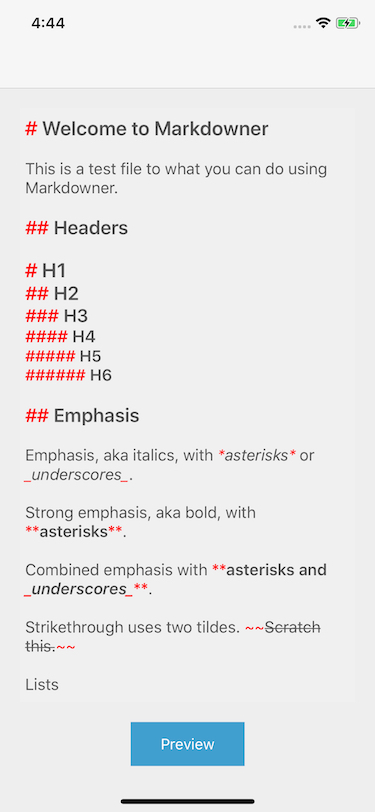

# Markdowner

[](https://travis-ci.org/rlaguilar/Markdowner)
[](https://cocoapods.org/pods/Markdowner)
[](https://cocoapods.org/pods/Markdowner)
[](https://cocoapods.org/pods/Markdowner)

`Markdowner` is a library intended to edit and preview markdown in real time. It supports custom markdown elements or use only a subset of the standard ones. Custom fonts and colors are also supported.  



## Example

To run the example project, clone the repo, and run `pod install` from the Example directory first.

## Requirements
Requires iOS 10 or later and Swift 4.1 or later.

## Installation

Markdowner is available through [CocoaPods](https://cocoapods.org). To install
it, simply add the following line to your Podfile:

```ruby
pod 'Markdowner'
```

## How to use it
The main entry point ot use `Markdowner` is using the custom type  `MarkdownTextView`, which is just a sublcass of `UITextView`.

```swift
var textView = MarkdownTextView(frame: parentView.bounds)
parentView.addSubview(textView)
textView.frame = ... // setup text view position inside its parent
textView.text = ... // set the initial markdown to display, if any

```

If you want to customize the default look of the markdown elements, you can use the class `StylesConfiguration`.

```swift
textView.stylesConfiguration = StylesConfiguration(
    baseFont: UIFont.systemFont(ofSize: 18),
    textColor: UIColor.darkGray,
    symbolsColor: UIColor.red
)
```

Creating custom elements is as simple as subclassing the type `MarkdownElement`, and then calling the function `textView.use(elements: [MarkdownElement])` passing as arguments the list of markdown elements that you want to use. As a guide for creating new elements you could use any of the already implemented ones inside the folder `Markdowner/Classes/Default Elements`.

It's important to note that for now `Markdowner` doesn't support initialization from Storyboards.

## Author

rlaguilar, rlac1990@gmail.com

## License

Markdowner is available under the MIT license. See the LICENSE file for more info.
